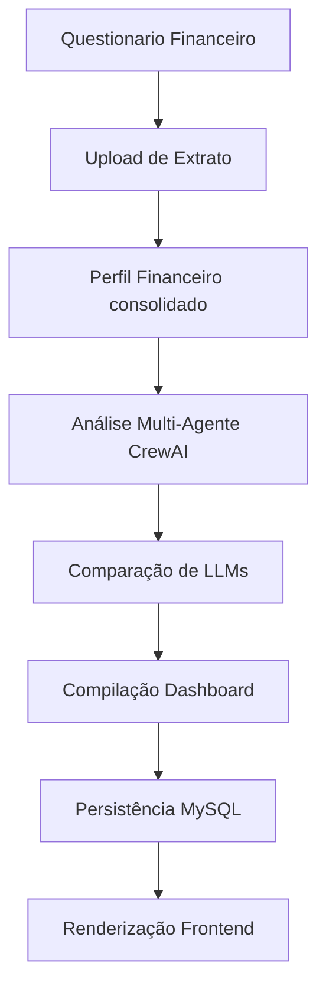

# Sistema de Aconselhamento Financeiro com LLMs

Sistema fullstack acadêmico para Trabalho de Conclusão de Curso (TCC) em Ciência da Computação que oferece análise financeira personalizada utilizando múltiplos modelos de linguagem (LLMs) locais.

## 🏗️ Arquitetura Implementada

### **Stack Tecnológico**
- **Backend**: FastAPI + SQLAlchemy + MySQL
- **Frontend**: React + TailwindCSS + Recharts
- **LLMs Locais**: Ollama (Llama2, Mistral, Gemma3)
- **Orquestração**: CrewAI Multi-Agent System
- **Containerização**: Docker + Docker Compose

### **Fluxo de Dados Implementado**
```
Questionário Financeiro -> Upload de Extrato → CrewAI Pipeline → Dashboard Analítico
```

## 🚀 Funcionalidades Reais Implementadas

### **1. Sistema de Autenticação e Perfil**
- ✅ Registro e login de usuários
- ✅ Gerenciamento de sessões com JWT
- ✅ Perfis financeiros personalizados
- ✅ Banco de dados MySQL com relacionamentos

### **2. Processamento de Extratos Bancários**
- ✅ Upload de arquivos CSV
- ✅ Categorização automática de transações
- ✅ Integração com LLMs locais via Ollama
- ✅ Análise de padrões de gastos via categorias

### **3. Sistema Multi-Agente CrewAI**
```yaml
Agentes Implementados:
- Extrator de Dados Financeiros
- Consultor Financeiro Pessoal
- Avaliador de Modelos LLM
```

### **4. Dashboard Analítico Interativo**
- ✅ Visualizações com gráficos (Recharts)
- ✅ Cards de métricas financeiras
- ✅ Histórico de análises
- ✅ Comparação entre modelos LLM
- ✅ Interface responsiva

### **5. Comparação de LLMs**
- ✅ Métricas de qualidade e performance
- ✅ Ranking automático de respostas
- ✅ Sistema de scoring por confiabilidade

## 📊 Dados Processados e Gerados

### **Entrada do Sistema**
```json
{
  "questionnaire_data": "Perfil financeiro do usuário",
  "extrato_bancario": "Transações em CSV/OFX",
  "objetivo_financeiro": "Meta definida pelo usuário"
}
```

### **Saída do Sistema**
```json
{
  "dashboard_data": {
    "financial_summary": {
      "total_income": "Receitas totais",
      "total_expenses": "Gastos totais", 
      "balance": "Saldo líquido"
    },
    "expense_categories": {
      "alimentacao": "Valor categorizado",
      "transporte": "Valor categorizado",
      "lazer": "Valor categorizado"
    },
    "advice": "Conselhos personalizados"
  },
}
```

## � Configuração e Execução

### **Pré-requisitos**
```bash
- Docker & Docker Compose
- Python 3.9+
- Node.js 16+
- 8GB RAM (para execução dos LLMs)
```

### **1. Configuração via Docker (Recomendado)**
```bash
# Clone o repositório
git clone https://github.com/tavss1/Aconselhamento-Financeiro-com-uso-de-LLMs.git
cd Aconselhamento-Financeiro-com-uso-de-LLMs

# Iniciar serviços de infraestrutura
cd backend
docker-compose up -d mysql ollama

# Aguardar inicialização e baixar modelos LLM
docker exec -it ollama_service ollama pull llama2
docker exec -it ollama_service ollama pull mistral  
docker exec -it ollama_service ollama pull gemma3
```

### **2. Configuração do Backend**
```bash
cd backend

# Criar ambiente virtual
python -m venv cv
cv\Scripts\activate  # Windows
source cv/bin/activate  # Linux/Mac

# Instalar dependências
pip install -r requirements.txt

# Configurar banco de dados
cp .env.example .env
# Editar .env com as configurações

# Executar aplicação
No terminal com o ambiente virtual ativo, digite uvicorn api_temp:app --host 0.0.0.0 --port 8000 --reload
```

### **3. Configuração do Frontend**
```bash
cd frontend

# Instalar dependências
npm install

# Iniciar aplicação
npm start
```

### **4. Acesso às Aplicações**
- **Frontend**: http://localhost:3000
- **Backend API**: http://localhost:8000
- **Documentação API**: http://localhost:8000/docs
- **Ollama WebUI**: http://localhost:3000 (Docker)
- **MySQL**: localhost:3307

## 🧪 Validação e Testes

### **Testes Implementados**
```bash
backend/test/
├── test_api_integration.py      # Testes de integração da API
├── test_auth.py                 # Autenticação e autorização
├── test_dashboard_api.py        # Endpoints do dashboard
├── test_financial_profile.py    # Perfil financeiro
├── test_ollama_categorization.py # Categorização com LLMs
└── test_parser_direct.py       # Parser de extratos
```

## 📈 Métricas de Performance Implementadas

### **Métricas de LLM**
- ✅ **Tempo de Resposta**: Latência por modelo
- ✅ **Score de Confiança**: Qualidade da resposta
- ✅ **Taxa de Sucesso**: Respostas válidas vs inválidas

### **Métricas Financeiras**
- ✅ **Capacidade de Poupança**: Baseada no fluxo de caixa
- ✅ **Debt-to-Income Ratio**: Proporção dívida/renda
- ✅ **Score Financeiro**: Classificação de saúde financeira
- ✅ **Categorização por Gastos**: Distribuição percentual

## 🎯 Resultados Acadêmicos Demonstráveis

### **Contribuições Técnicas**
1. **Sistema Multi-Agente Especializado**: Implementação de pipeline CrewAI para análise financeira
2. **Comparação Objetiva de LLMs**: Framework de avaliação para modelos de linguagem em contexto financeiro
3. **Categorização Inteligente**: Sistema híbrido (regex + LLM) para classificação de transações
4. **Dashboard Analítico**: Interface completa para visualização de dados financeiros

### **Validação Prática**
- ✅ **Upload e processamento** de extratos bancários reais
- ✅ **Geração de conselhos** personalizados via LLMs
- ✅ **Visualização interativa** de métricas financeiras
- ✅ **Histórico de análises** com comparação temporal
- ✅ **Sistema de navegação** completo entre funcionalidades

## 📁 Estrutura de Dados Real

### **Banco de Dados (MySQL)**
```sql
-- Tabelas implementadas
usuarios (id, nome, email, password, criado_em)
perfil_financeiro (id, usuario_id, questionnaire_data, objetivo, extrato)
llm_responses (id, perfil_id, modelo_ia, transaction_response, advice_response, dashboard_response, score)
```

### **Armazenamento de Arquivos**
```
backend/uploads/
├── {uuid}_extrato.csv           # Extratos processados
├── {uuid}_categorized.json      # Transações categorizadas
└── {uuid}_analysis.json         # Análises geradas
```

## 🔄 Pipeline de Processamento Real



## 🚀 Demonstração Funcional

O sistema está completamente funcional e permite:

1. **Criar conta** e fazer login
2. **Preencher questionário** financeiro personalizado
3. **Fazer upload** de extrato bancário (CSV)
4. **Aguardar processamento** via pipeline CrewAI
5. **Visualizar dashboard** com métricas e gráficos
6. **Consultar histórico** de análises anteriores
7. **Comparar performance** entre diferentes LLMs
8. **Navegar** entre configurações e resultados

---

**Desenvolvido para TCC em Ciência da Computação**  
*Sistema completo de análise financeira com tecnologias modernas e LLMs locais*
